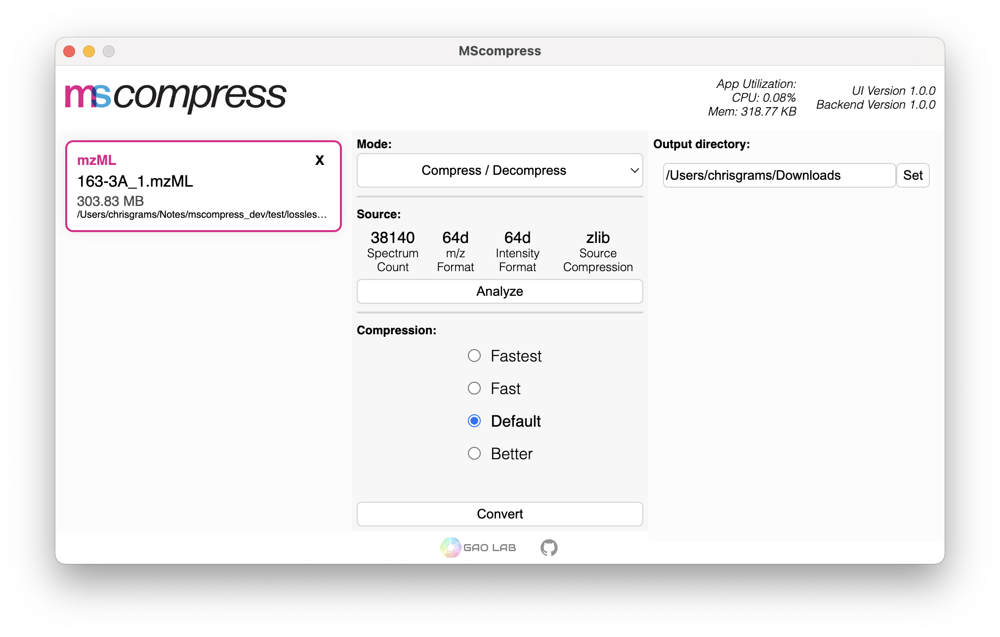
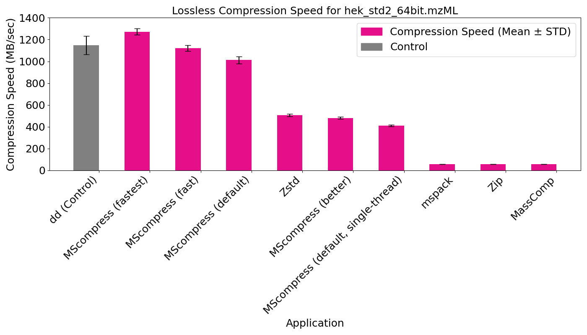
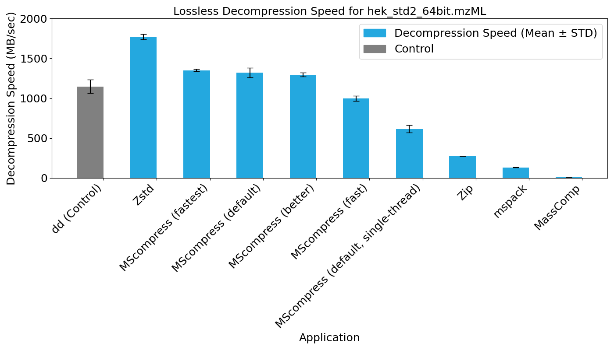

# MScompress


[](https://github.com/chrisagrams/mscompress/actions/workflows/build.yml)


MScompress is a multi-threaded lossless and lossy compression tool for Mass Spectrometry data. We introduce a novel compressed file format, *.msz*, which enables random-access to the compressed file without a full decompression.

<p align="center">
    
</p>

### Features
🌟 A graphical user interface supported on all platforms (Windows, macOS, Linux) (x86, Apple Silicon).

🌟 Multi-threaded compression and decompression.

🌟 State-of-the-art compression/decompression speeds.

🌟 Random-access to compressed file without full decompression.

🌟 Direct compression of vendor raw files (Thermo, Bruker, SCIEX, Waters) to `.msz`.

🌟 Python library (`pip install mscompress`) and Node.js/TypeScript library (`npm install mscompress`) for programmatic access.

🌟 Full TypeScript type definitions and ESM support.

MScompress's multi-threaded implementation achieves state-of-the-art compression/decompression speeds with mzML files compared to general-purpose compression tools and previous work in MS data compression while maintaining comparable compression ratios.

Tests conducted on an Intel Core i9-12900K paired with a Samsung 980 Pro NVMe:

<p align="center">
    
    
</p>

MScompress can be utilized as a standalone GUI application or through the command line interface. Additionally, we provide Python and Node.js/TypeScript libraries to utilize our preprocessing, compression, and decompression functions programmatically.

## Installation

### CLI
Our application is packaged as a portable executable containing all necessary dependencies with no installation required. Find the latest version for your platform under the [Releases](https://github.com/chrisagrams/mscompress/releases) tab.

### Python
```bash
uv add mscompress
# or
pip install mscompress
```

### Node.js / TypeScript
```bash
npm install mscompress
```


## Reporting Bugs
Our implementation is still currently in its pre-release stage undergoing further testing. If you experience any issues, we ask to please open a new [Issue](https://github.com/chrisagrams/mscompress/issues).

## Command-Line Usage
### Compression

To compress an `.mzML` file to lossless `.msz` format in same directory:
```
./mscompress in.mzML
```

or

```
./mscompress in.mzML out.msz
```

### Vendor Raw Files

MScompress can compress vendor raw files directly to `.msz` — Thermo `.raw`, Bruker timsTOF `.d` directories, SCIEX `.wiff`/`.wiff2`/`.t2d`, and Waters `.raw` directories — by converting them to mzML in memory through the compiled [raw2ms](https://github.com/chrisagrams/raw2ms) library and feeding the existing compression pipeline:

```
./mscompress in.raw
```

Requirements and behavior:

- The compiled raw2ms C library must be available at runtime. Set `RAW2MS_LIBRARY` to the path of `libraw2ms_capi.so` (`.dylib`/`.dll`), or install it on your library search path. Without it, raw input produces an instructive error; all other functionality is unaffected.
- The mzML intermediate is built fully in memory when an OOM check says it fits; for large runs it is instead streamed spectrum-by-spectrum into an anonymous in-memory staging file and processed through a memory map, keeping peak memory bounded. (Set `MSCOMPRESS_FORCE_CHUNKED=1` to force the chunked path.)
- SCIEX `.wiff` files can hold several runs (samples). One invocation converts one run; `--run-index N` selects which (default 0), and the log reports how many runs the file holds.
- All compression flags (`--mz-lossy`, `--int-lossy`, threads, formats, blocksize) apply as with mzML input. `--extract`/`--describe` require an `.msz` or `.mzML` file — compress the vendor file first.
- Corrupt input fails with the reader's diagnosis (a truncated Bruker `.d`, for instance, is reported with byte counts before any conversion work starts). `--salvage` instead skips spectra the reader cannot decode, warns with a summary, and converts the rest; a file that is truncated on disk is still rejected outright — re-download it.
- Per-peak ion mobility arrays (Bruker) are not stored; the `.msz` format carries m/z and intensity binary streams only.

### Decompression
To decompress, specify `.msz` file as first argument. Will output to `out.mzML`:
```
./mscompress out.msz
```

### Lossy Compression
Currently, we support the following lossy formats: cast, log, delta(16, 32), and vbr.

To specify delta32 lossy compression for m/z data and vbr lossy compression for intensity data:

```
./mscompress --mz-lossy delta32 --int-lossy vbr in.mzML
```


### Extract Spectrum
MScompress can extract spectra from either `.mzML` or compressed `.msz` files. Specific indicies, scan numbers, or MSn level can be extracted.

Ex. Extracting scan numbers 100-110 and 200-220
```
./mscompress --extract --extract-scans [100-110,200-220] in.mzML
```
or
```
./mscompress --extract --extract-scans [100-110,200-220] in.msz
```

Ex. Extracting all spectra with MS level 1
```
./mscompress --extract --ms-level 1 in.mzML
```
or 
```
./mscompress --extract --ms-level 1 in.msz
```


## Versioning

Versioning and releases are automated with [release-please](https://github.com/googleapis/release-please), driven by [Conventional Commits](https://www.conventionalcommits.org/). The version source of truth is `version.txt` at the repo root; CMake reads it, and `pyproject.toml`, `python/mscompress/__init__.py`, and all `package.json` files are kept in sync by release-please.

You do not bump the version manually. On every push to `main`, release-please opens (or updates) a **release PR** that bumps `version.txt` and the package files and updates `CHANGELOG.md` based on the commits since the last release. Merging that release PR creates the `vX.Y.Z` tag and GitHub Release, which in turn builds and publishes the CLI binaries, Python wheels (PyPI), Node packages (npm), and Docker image.

Bump sizing follows commit types: `feat:` → minor, `fix:`/`perf:`/`refactor:` → patch, and `feat!:`/`BREAKING CHANGE` → major.

## Compilation
Our repository relies on CMake to support cross-platform compilation. Ensure that the necessary dependencies are installed for compilation.
### Prerequisites
#### Linux (Ubuntu/Debian)
- Install the following build dependencies: `git`, `build-essential`, `cmake`
```
sudo apt update
sudo apt install git build-essential cmake
```

#### macOS 
- Install latest version of CMake: https://cmake.org/download/
    - Once installed, run CMake CLI installation script:
        - Open Terminal app
        - Run `sudo "/Applications/CMake.app/Contents/bin/cmake-gui" --install`

- Install Xcode command line tools:
    - Open Terminal app
    - Run `xcode-select --install`

#### Windows
*Instructions coming soon.*


### Command-line Tool
To compile the CLI version of MScompress:

1. Clone the repository if you haven't so already. Make sure to include the `--recurse-submodules` flag to properly fetch all dependencies.
```
git clone --recurse-submodules https://github.com/chrisagrams/mscompress.git
```
2. Navigate to cli directory and create a build directory
```
cd mscompress/cli
mkdir build
```
3. Navigate to build directory and configure the build
```
cd build
cmake ..
```
4. Build the executable
```
cmake --build ..
```
### Node.js/TypeScript Library
To compile the Node.js library:

1. Once cloned, navigate to `node-ts/`

```
cd node-ts/
```

2. Install dependencies and download pre-built native binary
```
npm install
```

3. Build TypeScript sources
```
npm run build
```

4. Run tests
```
npm test
```

Pre-built native binaries are available for macOS (x64, ARM64), Linux (x64, ARM64), and Windows (x64). If a pre-built binary is not available for your platform, the native addon will be compiled from source during `npm install` (requires a C++17 compiler and CMake).

### Electron GUI Application
To run/build Electron application:

1 . Navigate to `electron/`
```
cd electron/
```

2. To run in dev mode:
```
npm run start
```

3. To compile:
```
npm run build
```
