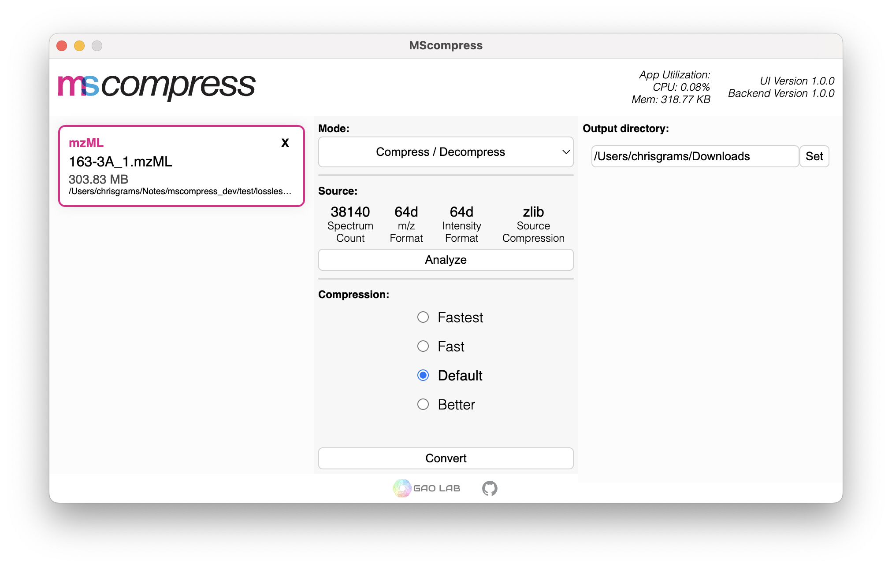

# MScompress


MScompress is a multi-threaded lossless and lossy compression tool for Mass Spectrometry data. We introduce a novel compressed file format, *.msz*, which enables random-access to the compressed file without a full decompression.

<p align="center">
    
</p>

### Features
🌟 A graphical user interface supported on all platforms (Windows, macOS, Linux) (x86, Apple Silicon).

🌟 Multi-threaded compression and decompression.

🌟 State-of-the-art compression/decompression speeds.

🌟 Random-access to compressed file without full decompression.

🌟 NodeJS library for server-side applications.

MScompress's multi-threaded implementation achieves state-of-the-art compression/decompression speeds with mzML files compared to general-purpose compression tools and previous work in MS data compression while maintaining comparable compression ratios.

Tests conducted on an Intel Core i9-12900K paired with a Samsung 980 Pro NVMe:

<p align="center">
    
    
</p>

MScompress can be utilized as a standalone GUI application or through the command line interface. Additionally, we provide a NodeJS library to utilize our preprocessing, compression, and decompression functions in a node environment.

## Installation
Our application is packaged as a portable executable containing all necessary dependencies with no installation required. Find the latest version for your platform under the [Releases](https://github.com/chrisagrams/mscompress/releases) tab.


## Reporting Bugs
Our implementation is still currently in its pre-release stage undergoing further testing. If you experience any issues, we ask to please open a new [Issue](https://github.com/chrisagrams/mscompress/issues).

## Compilation
Our repository relies on CMake to support cross-platform compilation. Ensure that the necessary dependencies are installed for compilation.
### Prerequisites
#### Linux (Ubuntu/Debian)
- Install the following build dependencies: `git`, `build-essential`, `cmake`
```
sudo apt update
sudo apt install git build-essential cmake
```

#### macOS 
- Install latest version of CMake: https://cmake.org/download/
    - Once installed, run CMake CLI installation script:
        - Open Terminal app
        - Run `sudo "/Applications/CMake.app/Contents/bin/cmake-gui" --install`

- Install Xcode command line tools:
    - Open Terminal app
    - Run `xcode-select --install`

#### Windows
*Instructions coming soon.*


### Command-line Tool
To compile the CLI version of MScompress:

1. Clone the repository if you haven't so already. Make sure to include the `--recurse-submodules` flag to properly fetch all dependencies.
```
git clone --recurse-submodules https://github.com/chrisagrams/mscompress.git
```
2. Navigate to cli directory and create a build directory
```
cd mscompress/cli
mkdir build
```
3. Navigate to build directory and configure the build
```
cd build
cmake ..
```
4. Build the executable
```
cmake --build ..
```
### NodeJS Native-API (NAPI) Library
To compile NAPI library:

1. Once cloned, navigate to `node/`

```
cd node/
```

2. Fetch dependencies and compile
```
npm install
```

### Electron GUI Application
To run/build Electron application:

1 . Navigate to `electron/`
```
cd electron/
```

2. To run in dev mode:
```
npm run start
```

3. To compile:
```
npm run build
```
