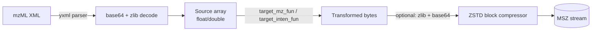

# How the algorithm system works

The algorithm system is a small, table-driven dispatch in C. It does three
things:

1. Holds a static **registry** of named transforms with their default
   parameters.
2. **Dispatches** by `(algorithm ID, data type accession)` to the right
   encoder/decoder function pointer.
3. Composes those function pointers with the **encode/decode pipeline**
   (optional zlib, base64, then ZSTD).

The whole system lives in `src/algo.c` and `src/algos/*.c` with declarations
in `src/algos/algos.h` and `src/mscompress.h`.

## The registry

`algo_registry` (in `src/algo.c`) is a static array of `algo_info_t`. Each
entry is just metadata — no function pointers — used to populate `--list-algorithms`,
validate CLI input, and document the algorithm:

```c
typedef struct {
   const char* name;
   int type;                    // algorithm ID, e.g. _delta32_transform_
   int target;                  // TARGET_MZ, TARGET_INT, or both
   const char* description;
   float default_mz_scale;
   float default_int_scale;
   int experimental;
} algo_info_t;
```

The 10 algorithms registered today:

| Name | ID | Target | Default mz scale | Default int scale | Experimental |
|------|------|--------|-----------------|-------------------|--------------|
| `cast` | `_cast_64_to_32_` | mz | 0 | 0 | no |
| `cast16` | `_cast_64_to_16_` | mz | 11.801 | 0 | no |
| `delta16` | `_delta16_transform_` | mz | 127.998 | 0 | no |
| `delta24` | `_delta24_transform_` | mz | 65536 | 0 | no |
| `delta32` | `_delta32_transform_` | mz | 262144 | 0 | no |
| `bitpack` | `_bitpack_` | mz | 10000 | 0 | no |
| `log` | `_log2_transform_` | int | 0 | 72 | no |
| `vbr` | `_vbr_` | mz, int | 0.1 | 1.0 | no |
| `vdelta16` | `_vdelta16_transform_` | mz | 0 | 0 | **yes** |
| `vdelta24` | `_vdelta24_transform_` | mz | 0 | 0 | **yes** |

`_lossless_` is always available and not listed in the registry.

## Dispatch

Function pointers live in `data_format_t` (declared in `src/mscompress.h`). At
runtime, two switch statements in `src/algo.c` resolve names to function
pointers:

- `set_compress_algo(int algo, int accession)` — returns the **encoder** for
  `(algorithm, source data type)`.
- `set_decompress_algo(int algo, int accession)` — returns the **decoder**.

`accession` is the mzML data-type accession (`_32f_`, `_64d_`, etc., defined
in `src/mscompress.h`). The same algorithm typically has separate variants for
32-bit and 64-bit source data — for example, `delta32` resolves to
`algo_encode_delta32_transform_64d` when the source is `double`, or
`algo_encode_delta32_transform_32f` when it's `float`.

When the user picks `--mz-lossy delta32` on the CLI:

1. `set_mz_lossy()` validates the name against the registry.
2. `set_compress_runtime_variables()` resolves `(_delta32_transform_, source_mz_fmt)`
   to a function pointer and stores it in `data_format_t.target_mz_fun`.
3. During compression, the m/z worker calls `target_mz_fun(&args)` once per
   block.

## The encoder/decoder contract

Every algorithm exposes a single function signature:

```c
typedef void (*Algo)(void*);
```

The `void*` is always cast to `algo_args*` (see `src/mscompress.h`). The
function reads `src`, applies the transform, and writes to `dest`,
updating `*dest_len`. **The caller owns both buffers.** Lifetime extends
through the call only — the function must not store either pointer.

For symmetric round-tripping, every encoder has a matching decoder named the
same way but with `decode` instead of `encode`:

| Encoder | Decoder |
|---------|---------|
| `algo_encode_delta32_transform_64d` | `algo_decode_delta32_transform_64d` |
| `algo_encode_log_2_transform_32f` | `algo_decode_log_2_transform_32f` |

## The end-to-end pipeline



- `encode_source_compression_*_fun` (in `src/encode.c`) — base64/zlib output
  encoding, applied **after** the algorithm transform so the data lands in
  the MSZ in a deterministic form regardless of how the mzML stored it.
- `*_compression_fun` (zstd or lz4 wrapper from `src/compress.c`) — the
  block-level compressor for each of the three streams.

Decompression runs the same pipeline in reverse: ZSTD decompress → optional
base64/zlib decode → algorithm decoder → original-typed array.
