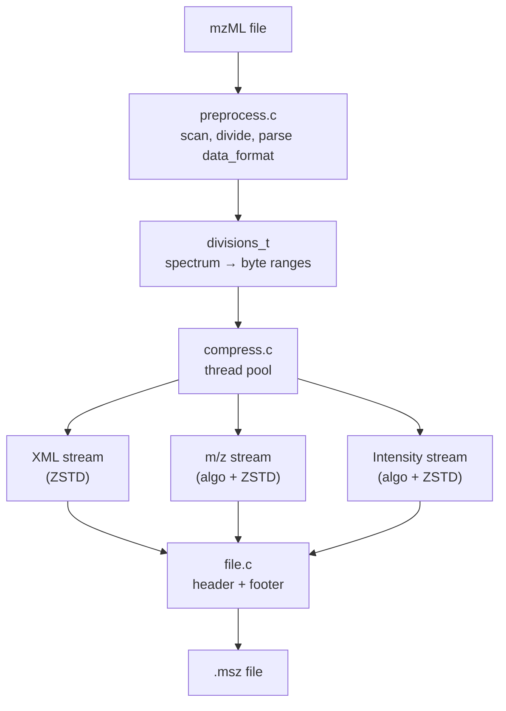

# Architecture

A high-level tour of the C core. For algorithm specifics, see
[Algorithms](../algorithms/index.md). For the byte-level format, see the
[MSZ spec](../format/msz.md).

The C source lives in `src/`, the CLI in `cli/`, and vendor libraries in
`vendor/`. The complete public API is in `src/mscompress.h`.

## Source tree

| File | Role |
|------|------|
| [`src/mscompress.h`](https://github.com/chrisagrams/mscompress/blob/main/src/mscompress.h) | All type definitions and function declarations |
| `src/preprocess.c` | mzML parsing (yxml), file division, format detection |
| `src/compress.c` | Multi-threaded compression pipeline |
| `src/decompress.c` | Multi-threaded decompression |
| `src/extract.c` | Spectrum extraction with index-based filtering |
| `src/algo.c` | Algorithm registry and dispatch |
| `src/algos/` | One file per algorithm family |
| `src/encode.c` / `src/decode.c` | Base64 and zlib wrappers for the inner encoding chain |
| `src/queue.c` | Block-length and compressed-block queue management |
| `src/file.c` | I/O, mmap, header/footer (de)serialization |
| `src/mem.c` | Allocation helpers for data blocks |
| `src/zl.c` | zlib wrappers |
| `src/arguments.c` | Argument parsing and validation |
| `src/sys.c` | Platform glue (threads, CPU count) |

## Pages in this section

- [Compression pipeline](compression-pipeline.md)
- [Decompression pipeline](decompression-pipeline.md)
- [Extraction](extraction.md)
- [Data structures](data-structures.md)
- [Memory ownership rules](memory-ownership.md)
- [Vendor libraries](vendor-libraries.md)
